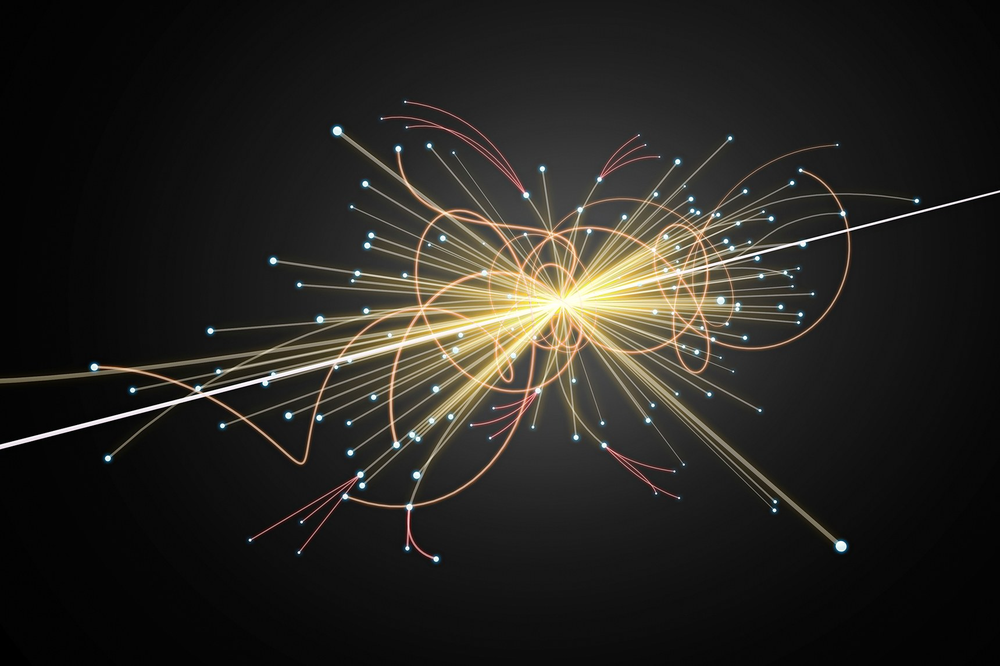

# Machine learning package for high-energy physics



## Overview of the package:
This software provides a flexible, modular and easy-to-use package to perform classification using Scikit, XGBoost and Keras algorithms. The first purpose of the package is to provide tools for high-energy physicists to perform optimisation of rare signals produced in ultra-relativistic proton-proton and heavy-ion collisions. 

## The package (v0) provides tools to:
- convert ROOT datasets into Pandas Dataframes
- create training and testing dataset starting from samples of data and Monte-Carlo simulations
- perform Principal-Component-Analysis
- training and testing using Scikit, XGBoost and Keras algorithms
- large set of validation tools with a user friendly interface
- conversion of Pandas Dataframe to ROOT objects including algorithm decisions and probabilities

## Instructions and tutorials
Instructions for installing and running the package are provided in the Wiki section of this repository [wiki](https://github.com/ginnocen/MachineLearningHEP/wiki).

## The ALICE Collaboration at CERN
Visit the collaboration website for more information about studies of hot nuclear matter at the Large Hadron Collider at CERN
http://alice-collaboration.web.cern.ch

## Contacts
For any questions please contact <ginnocen@cern.ch>

# Installation

## Usage with aliBuild software stack

This package depends on functionality offered by external packages, e.g. RooUnfold and O2Physics.
In order to use these packages from the aliBuild software stack, you should first install the aliBuild packages, and setup mlhep within the aliBuild environment.
To install the python dependencies run the following (from within the aliBuild environment) in the root directory of mlehp:
```
python3 -m pip install -r requirements.txt
```
